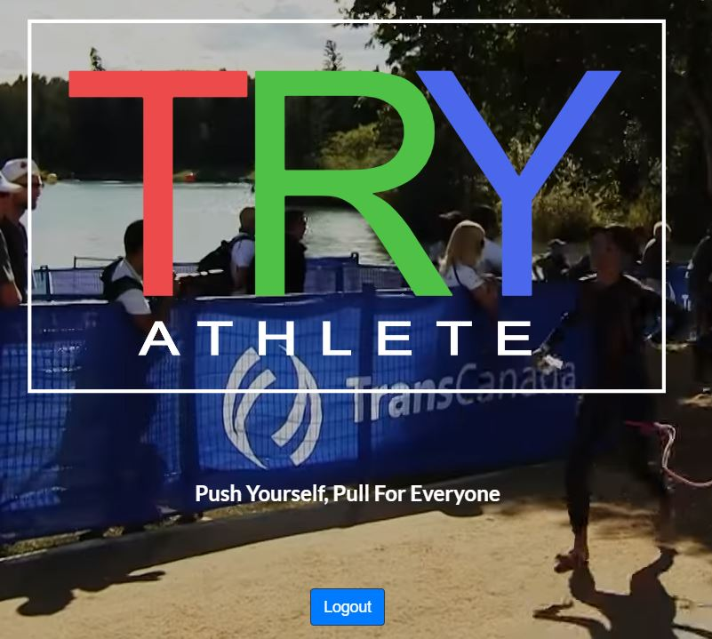
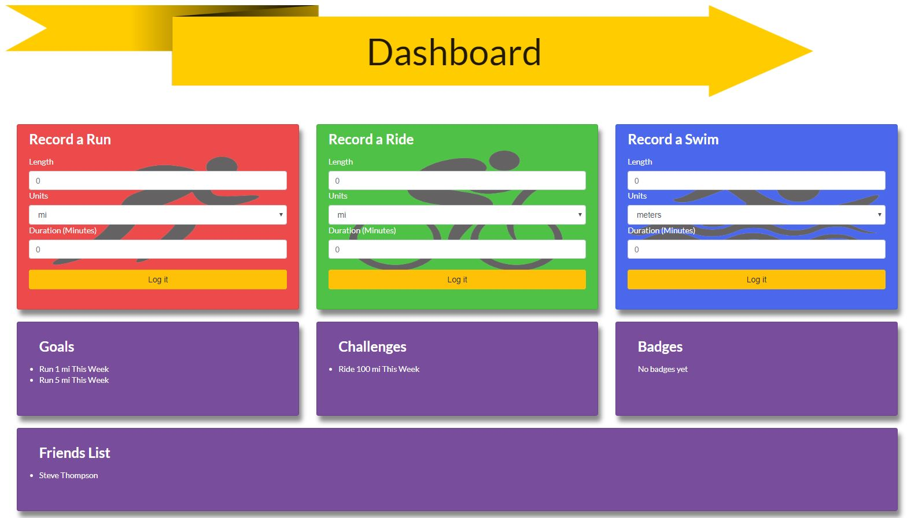
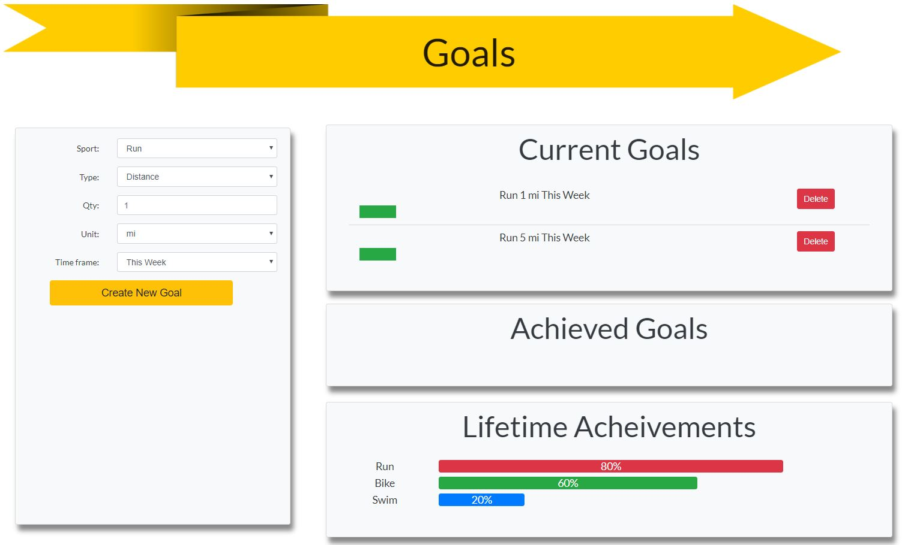
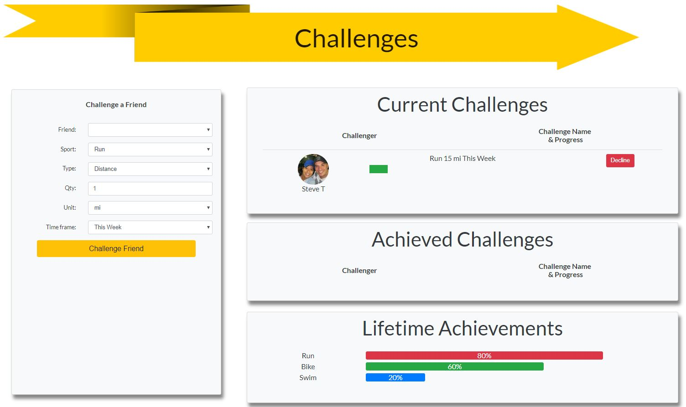
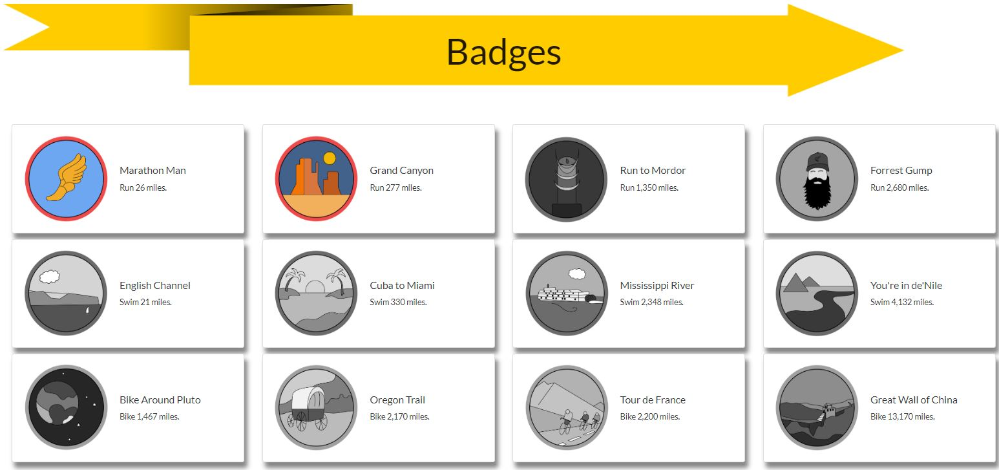
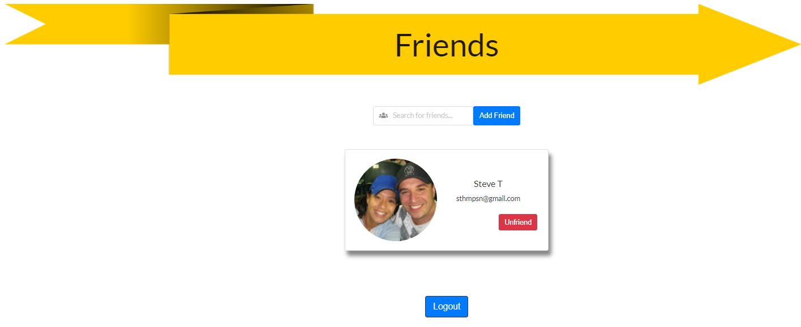

# TryAthlete

TryAthlete is a fully-functional full stack fitness tracking application designed for endurance athletes. The application allows for users to log running, biking, and swimming workouts to keep up-to-date records of their fitness routines.  Users can also set distance, time, and frequency goals to keep themselves motivated, and can also add and challenge friends.

 
## Deployed Application:
https://my-try-athlete.herokuapp.com/

## Technologies
* Bootstrap framework (React-Bootstrap)
* Mongoose
* MongoDB
* Express.js
* React.js
* Node.js
* Visual Basic - Text Editor
 
## Screenshots

 

## Contributors
* Ashlen Bruns (ashlenbruns)
* Scott Anderson (ScottTAnderson)
* Bryan Bloomquist (bryanbloomquist)
* John Evans (evanjo03)
* Steve Thompson (sthmpsn)
